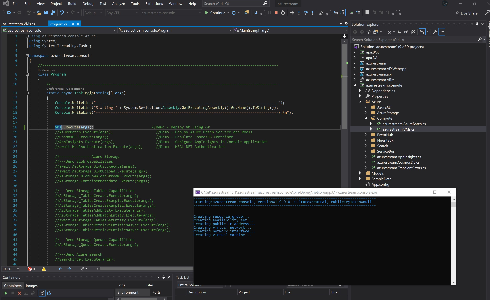

# Introduction 
This Repo contains a .NET 5.0 Visual 2019 Project called **Azurestream**. This Project was built for the purposes of giving Azure Engineers
a functioning Visual Studio 2019 and Visual Studio Code Project that they could leverage for demos, presentations or simply just improving
their C# and Azure skills. The solution contains a number of demos that could come in extremely useful during your deliveries.

# Getting Started
Getting your code up and running on their own system. 
1.  **Download/Clone** Azurestream Repository and place in C:/Git folder
  
2.	Open **C:\Git\azurestream\azurestream\azurestream.ARM\1.Environment Installs.txt** and make sure you have the following installed
    - Demo Possibilities:	
    - .NET Core 5.0
    - Azure CLI
    - Visual Studio 2019 - Community Edition is fine. 
    - Visual Studio Code and Extensions
    - Postman
  
3.	Open the Visual Studio Solution file in VS 2019 **C:\Git\azurestreamrepo\azurestream\azurestream.sln**
  
4.	Build the whole solution
  
5.  YOU WILL NEED THE FOLLOWING RESOURCES DEPLOYED IN AZURE:
    - AZURE KEY VAULT
    - AZURE REDIS CACHE INSTANCE
    - AZURE BLOB STORAGE ACCOUNT
    - AZURE SQL DB 
    - AZURE COSMOSDB
    - Web APP and App Insights Instance
  
6.  Configure and update the following files in your Project:
    - To get the Azurestream website to work:
        - **C:\Git\azurestream\azurestream\azurestream\appsettings.Development.json** 
            - Configure Redis and SQL Connections
        - **C:\Git\azurestream\azurestream\azurestream\appsettings.json**
            - Configure Redis and SQL Connections
            - Configure CosmosDB Connection
            - Configure AzureAd
            - Configure Cloud Storage Account
            - Configure App Insights Instrumentation Key
        - **C:\Git\azurestream\azurestream\azurestream\azurekeyvault.json**
            - Configure Connection to Azure Key Vault
    - To get the Azurestream.AD.WebApp website to work:
        - **C:\Git\azurestream\azurestream\azurestream.AD.WebApp\appsettings.json**
            - Configure Azure AD Domain, Tenant and Service Principal Introduction
    - To get the Azurestream.API to work:
        - **C:\Git\azurestream\azurestream\azurestream.api\appsettings.json**
            - Configure Redis and SQL Connections
        - **C:\Git\azurestream\azurestream\azurestream.api\azurekeyvault.json**
            - Configure Connection to Azure Key Vault
    - To get the Azurestream.ARM to work:
        - **C:\Git\azurestream\azurestream\azurestream.ARM\Azure.CLI.azcli**
            - Configure your Subscription, Tenant, ServicePrincipal
    - To get the Azurestream.console to work:
        - **C:\Git\azurestream\azurestream\azurestream.console\App.config**
        - **C:\Git\azurestream\azurestream\azurestream.console\azureauth.properties**
        - **C:\Git\azurestream\azurestream\azurestream.console\azureauth.txt**
            - Configure your connections and subscription and Tenant
    - To get the Azurestream.FuncAPP to work:
        - **C:\Git\azurestream\azurestream\azurestream.funcapp\local.settings.json**
            - Configure your Connections 
  
        
# Contents
1.	**Azurestream** (.NET Core 3.1 Web Project) 
    - Demo Possibilities:
        - Demo how to connect to Azure Key Vault
        - Demo how to connect to Azure Redis Cache, populate Key/Values in cache and use an invalidation policy.
        - Demo how to use Application Insights and properly configure the SDK on both the client and server sides.
        - Demo how to configure Azure AD Authentication and bring back an Authentication Token
        - Demo how to use NLog and send logs to Blob Storage Containers.
        - Demo how to run web app in Docker Container, and also explain what a Docker file
  

2.	**Azurestream.AD.WebApp** (.NET Core 3.1 Web Project) 
    - Bare-Bones Website 
        - Simple application that gives you what you need to demo Azure AD Authentication
    - Demo Possibilities:
        - Demo how to configure Azure AD Authentication and bring back an Authentication Token
  
3.	**Azurestream.API** (.NET Core 3.1 API Project) 
    - Bare-Bones .NET API that has what it needs to demo a simple API and Swagger capabilities.
    - Demo Possibilities:
        - Demo how to configure Swagger and what the Swagger UI looks like.
        
  
4. **Azurestream.ARM** (ARM Project) 
    - Demo Possibilities:
        - **Azure.CLI.azcli - Pool of Azure CLI examples and demos**
        - **Azure.PS.ps1 - Pool of Azure PowerShell examples and demos**
        - **EnvironmentInstalls.txt** - What you need on your machine to run the Project
        - **Demo.CLI.azcli** - Demo Steps from AZ204 SkillPipe. Use this if you can't get demos to run correctly.
        - Demo Postman - Postman Collection so that you can demo REST Operations against Azure
            - Microsoft REST.postman_collection.json
            - Microsoft REST.postman_environment.json
            - Demo Acquiring Azure Authentication Token
            - Demo Get Resource Groups
            - Demo Get Blob Images using SAS Token
            - Demo Get Blob Containers using SAS Token
            - Demo Get Azure Table Entities using SAS Token
            - Demo Post Azure Table Entity
            - Demo Get Azure Table Entities with Filter
            - Demo PUT Azure Table Entity
        - Demo Kubernetes example yaml file
        - Demo Kubernetes azure-vote.yaml file from (https://docs.microsoft.com/en-us/azure/aks/kubernetes-walkthrough)
        - Exam Reference file for your students - **AZ204Reference.azcli**
  
5.	**Azurestream.Console** (.Net Core 3.1 Console Application) 
    - Demo Possibilities:
        - Demo VM Creation with C#
        - Demo Azure Batch Creation with C#
        - Demo CosmosDB with C#
        - Demo MSAL.NET Authentication with C#
        - Demo Azure Blobs with C#
        - Demo Azure Tables with C#
        - Demo Azure Queues with C#
        - Demo Azure Search with C#
        - Demo Event Hubs with C#
        - Demo Service Bus with C#
        - Demo Fluent SDK
        - Demo Transiant Errors with C#
        - I will be continually growing the pool of samples as this evolves. 

        
  
6.	**Azurestream.FuncApp** (.Net Core 3.1 Azure Function Project) 
    - Demo Possibilities:
        - Demo Timer Trigger
        - Demo HTTP Trigger
        - Demo Blob Trigger
        - Demo Blob Trigger to CosmosDB
        - Demo Queue Trigger
        - Demo Durable Functions.
     
  
7.	**Azurestream.LogicApp** (ARM Logic App Project) 
    - Demo Possibilities:
        - Demo Twitter Sentiment Analysis 
        - Demo Logic App Workspace
        - Demo Logic App Actions
        - Demo Logic App ARM Template
        - Demo Logic App Development in Visual Studio
    
  
8.	**apa.BOL** (.NET Standard Business Object Layer) 
9.	**apa.DAL** (.NET Standard Data Access Layer) 

# Build and Test
TODO: Describe and show how to build your code and run the tests. 

# Contribute
TODO: Explain how other users and developers can contribute to make your code better. 

If you want to learn more about creating good readme files then refer the following [guidelines](https://docs.microsoft.com/en-us/azure/devops/repos/git/create-a-readme?view=azure-devops). You can also seek inspiration from the below readme files:
- [ASP.NET Core](https://github.com/aspnet/Home)
- [Visual Studio Code](https://github.com/Microsoft/vscode)
- [Chakra Core](https://github.com/Microsoft/ChakraCore)